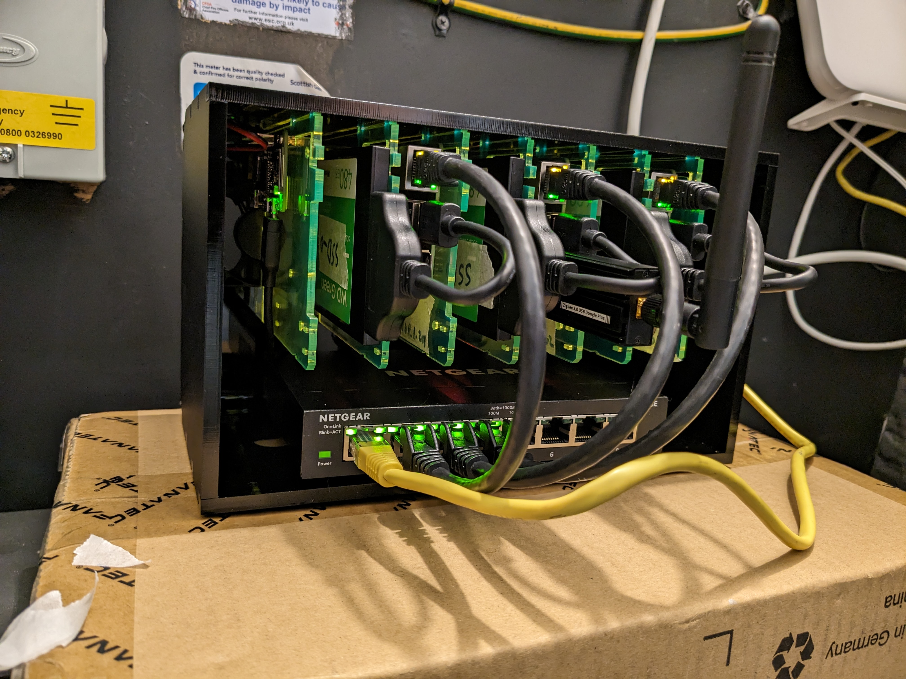

# Home Cluster

This repo contains the configuration for my home kubernetes cluster. It is based on [onedr0p's flux-cluster-template](https://github.com/onedr0p/flux-cluster-template), which has helped me learn a lot about all the bits needed to run a k8s cluster the gitops way.

## ✨ Features

- Automated, reproducible, customizable setup through Ansible templates and playbooks
- Opinionated implementation of Flux
- Encrypted secrets thanks to [SOPS](https://github.com/getsops/sops) and [Age](https://github.com/FiloSottile/age)
- Web application firewall thanks to [Cloudflare Tunnels](https://developers.cloudflare.com/cloudflare-one/connections/connect-networks/)
- SSL certificates thanks to [Cloudflare](https://cloudflare.com) and [cert-manager](https://cert-manager.io)
- HA control plane capability thanks to [kube-vip](https://kube-vip.io)
- Next-gen networking thanks to [Cilium](https://cilium.io/)

## 💾 Hardware

The cluster is currently 3 Raspberry Pi 4s in a ~trenchcoat~ [C4 Cloudlet Cluster Case](https://thepihut.com/products/8-slot-cloudlet-cluster-case)

| Role    | Name  | Cores | Memory | System Disk |
|---------|-------|-------|--------|-------------|
| Control | k8s-0 | 4     | 8GB    | 500GB SSD   |
| Control | k8s-1 | 4     | 4GB    | 500GB SSD   |
| Control | k8s-2 | 4     | 4GB    | 500GB SSD   |

In addition, there is pihole running on a Pi Zero W 2 (primarily for local DNS) - but I have had stability issues so use the DNS features built in to my Nokia router.
